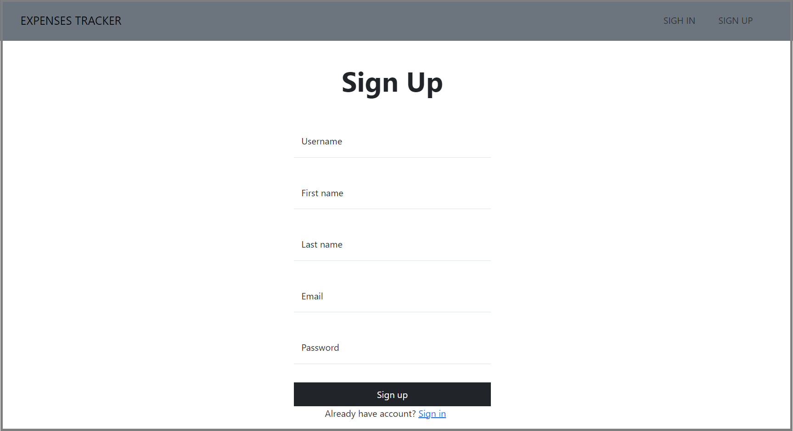

# Expense Tracker — Spring Boot, Docker & Jenkins CI/CD


## Overview

**Expense Tracker** is a Java-based web application built with **Spring Boot** that allows users to securely manage and track their expenses.

The application provides user authentication and authorization using **Spring Security**, database persistence using **Spring Data JPA and MySQL**, and a server-side web interface using **Thymeleaf and Bootstrap**.

The application is also **containerized using Docker** and deployed using **Docker Compose**. A **Jenkins CI/CD pipeline** automates the process of retrieving the source code from GitHub, building the Docker image, deploying the application containers, and verifying the deployment.

This project demonstrates practical experience with **Java application development, containerization, CI/CD automation, Docker Compose, Jenkins, GitHub, and Linux-based deployment**.

---

## Architecture

```text
                        Developer
                            |
                            | Git Push
                            v
                    +---------------+
                    |    GitHub     |
                    |  Repository   |
                    +-------+-------+
                            |
                            | SSH
                            v
                    +---------------+
                    |    Jenkins    |
                    |   CI/CD       |
                    +-------+-------+
                            |
                +-----------+-----------+
                |           |           |
                v           v           v
           Checkout    Docker Build   Deploy
                |           |           |
                +-----------+-----------+
                            |
                            v
                    +---------------+
                    | Docker Host   |
                    +-------+-------+
                            |
                 +----------+----------+
                 |                     |
                 v                     v
        +----------------+    +----------------+
        | Spring Boot    |    |     MySQL      |
        | Application     |    |    Database    |
        | Container       |    |    Container   |
        +----------------+    +----------------+
```

---

## CI/CD Workflow

The Jenkins pipeline automates the application deployment workflow.

```text
GitHub
   |
   v
Jenkins Checkout
   |
   v
Build Docker Image
   |
   v
Stop Existing Containers
   |
   v
Remove Old Containers
   |
   v
Docker Compose Deployment
   |
   v
Verify Containers
   |
   v
Deployment Complete
```

### Pipeline Stages

| Stage                  | Description                                                                        |
| ---------------------- | ---------------------------------------------------------------------------------- |
| **Checkout**           | Retrieves the `main` branch from GitHub using SSH credentials                      |
| **Build Docker Image** | Builds the application Docker image                                                |
| **Deploy Application** | Stops existing containers and deploys the updated application using Docker Compose |
| **Verify Deployment**  | Checks running containers and available Docker images                              |

---

## Application Features

### Authentication & Security

* User registration and authentication
* User authorization
* Protected application resources using Spring Security

### Expense Management

* Add expenses
* View expenses
* Update expenses
* Delete expenses
* Filter expense records

### Database

* MySQL database
* Spring Data JPA for database interaction
* Persistent application data

### User Interface

* Thymeleaf server-side rendering
* Bootstrap-based responsive interface

---

## DevOps & CI/CD Features

This project demonstrates:

* Git source code management
* GitHub repository management
* Jenkins CI/CD pipeline
* Jenkins Pipeline as Code
* Docker image creation
* Docker containerization
* Docker Compose orchestration
* Container lifecycle management
* Linux-based deployment
* Deployment verification
* Automated application deployment

---

## Technologies Used

### Backend

* Java
* Spring Boot
* Spring MVC
* Spring Security
* Spring Data JPA

### Database

* MySQL

### Frontend

* Thymeleaf
* Bootstrap
* HTML/CSS

### DevOps

* Git
* GitHub
* Jenkins
* Docker
* Docker Compose
* Maven
* Linux

---

## Project Structure

```text
expense-tracker/
│
├── src/
│   ├── main/
│   │   ├── java/
│   │   │   └── com/
│   │   │       └── SpringBootMVC/
│   │   │           └── ExpensesTracker/
│   │   │
│   │   └── resources/
│   │       ├── static/
│   │       ├── templates/
│   │       └── application.properties
│   │
│   └── test/
│       └── java/
│           └── ...
│
├── screenshots/
│   ├── 1.png
│   ├── 2-2.png
│   ├── 3-3.png
│   └── ...
│
├── Dockerfile
├── docker-compose.yml
├── Jenkinsfile
├── pom.xml
├── mvnw
├── mvnw.cmd
├── .gitignore
└── README.md
```

---

## Jenkins Pipeline

The project uses a Jenkins Pipeline to automate the build and deployment process.

The pipeline:

1. Checks out the `main` branch from GitHub.
2. Authenticates with GitHub using an SSH credential.
3. Builds the Docker image.
4. Stops existing Docker Compose services.
5. Removes old application and database containers.
6. Starts the updated services using Docker Compose.
7. Verifies the deployment using Docker Compose and Docker image information.
8. Displays deployment logs if the pipeline fails.

### Pipeline Configuration

The Docker image is tagged as:

```text
expensesapp:latest
```

The deployment manages the following containers:

```text
expenses-app
mysql-db
```

---

## Docker Deployment

The application is containerized so that the application and its dependencies can be deployed consistently across environments.

Docker Compose is used to manage the application services.

Typical deployment command:

```bash
docker compose up -d --build
```

To stop the deployment:

```bash
docker compose down
```

To view running containers:

```bash
docker compose ps
```

To view application logs:

```bash
docker compose logs
```

---

## Running the Application Locally

### Prerequisites

Install the following tools:

* Java 17+
* Maven
* Git
* Docker
* Docker Compose
* MySQL (if running the database outside Docker)

Verify the installations:

```bash
java -version
mvn -version
docker --version
docker compose version
git --version
```

---

### Clone the Repository

```bash
git clone https://github.com/Aryann-Ji/Java-application-deploy-jenkins
```

Navigate into the project:

```bash
cd Java-application-deploy-jenkins
```

---

### Build the Application

Using Maven:

```bash
mvn clean package
```

The application artifact will be generated inside the `target/` directory.

You can also use the Maven Wrapper included in the repository:

```bash
./mvnw clean package
```

On Windows:

```bash
mvnw.cmd clean package
```

---

## Run with Docker Compose

Build and start the application:

```bash
docker compose up -d --build
```

Check the running services:

```bash
docker compose ps
```

View logs:

```bash
docker compose logs -f
```

Stop the application:

```bash
docker compose down
```

---

## Deployment Verification

After deployment, the Jenkins pipeline verifies the Docker environment using:

```bash
docker compose ps
docker images
```

This confirms that the Docker Compose services have been started and that the expected Docker images are available.

---

## Testing

The project contains a Spring Boot application context test.

The test verifies that the Spring application context can start successfully:

```java
@SpringBootTest
class ExpensesTrackerApplicationTests {

    @Test
    void contextLoads() {
    }

}
```

Run the tests with Maven:

```bash
mvn test
```

> The current Jenkins pipeline does not contain a dedicated automated test stage. Tests can be added to the CI pipeline as a future improvement.

---

## Screenshots

### Login


### Dashboard


### Expense Management


### Expense Filtering



Additional screenshots are available in the `screenshots/` directory.

---

## Key Learning Outcomes

Through this project, I gained hands-on experience with:

* Developing a Spring Boot web application
* Implementing authentication with Spring Security
* Working with Spring Data JPA and MySQL
* Managing source code using Git and GitHub
* Creating Docker images
* Containerizing a Spring Boot application
* Managing multiple services with Docker Compose
* Creating Jenkins CI/CD pipelines
* Automating Docker-based deployments
* Managing application containers
* Troubleshooting deployment failures
* Verifying application deployments on a Linux environment

---

## Future Improvements

Potential improvements to the CI/CD pipeline include:

* Add an automated Maven test stage
* Add Docker image tagging using Git commit IDs
* Add Docker image vulnerability scanning
* Push images to a container registry
* Add application health checks
* Add rollback functionality
* Add Jenkins notifications
* Add environment-specific deployments
* Use Jenkins credentials/environment variables for sensitive configuration
* Add monitoring and logging

---

## Credits

This project was developed for learning purposes with reference to resources from **TrainWithShubham**.

The project was used to gain practical experience with Spring Boot application development, Docker containerization, and Jenkins-based CI/CD deployment.

---

## License

This project is licensed under the MIT License.
